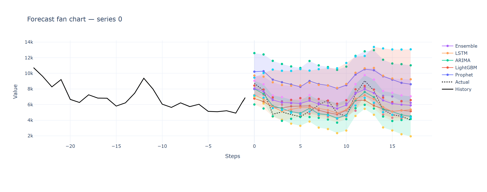
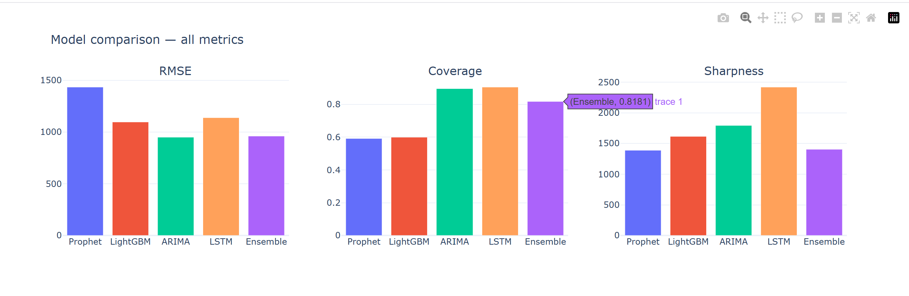
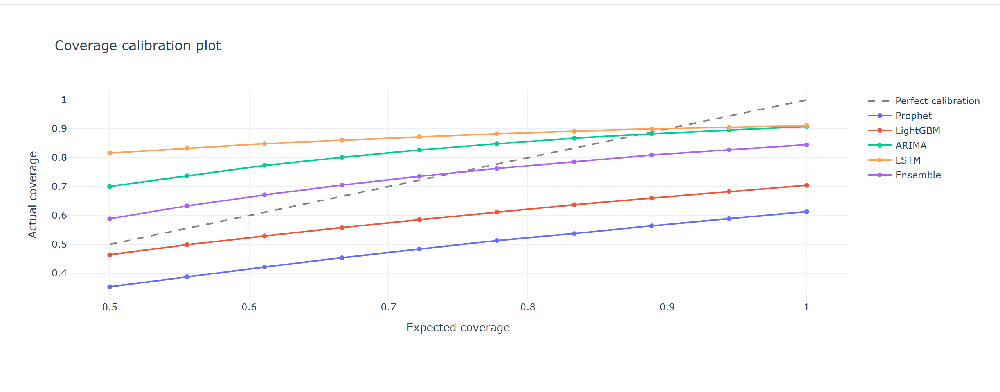

# Multi-Model Time-Series Forecasting Benchmark

Benchmarks five forecasting models on the M4 monthly competition
dataset, evaluating both point forecast accuracy and calibrated
prediction interval quality across 1000 time series.

## Author
Rohit
GitHub: https://github.com/Rohit-222111
Project: https://github.com/Rohit-222111/TS-Forecasting-Benchmark

---

## Models Benchmarked

| Model | Type | Description |
|:------|:-----|:------------|
| Prophet | Bayesian curve-fit | Facebook forecasting tool, trend/seasonal |
| LightGBM | Gradient boosting | Fast ML with lag features and quantile regression |
| ARIMA | Classical statistical | Auto-Regressive Integrated Moving Average |
| LSTM | Deep learning (GPU) | Long Short-Term Memory, trained on RTX 5060 |
| Ensemble | Model combination | Equal-weighted average of all four models |

---

## Evaluation Metrics

- **RMSE** — Root Mean Squared Error. Lower is better.
- **Coverage** — Fraction of actuals inside the 95% prediction interval. Target >= 0.95. Higher is better.
- **Sharpness** — Mean width of prediction intervals. Lower is better when coverage is satisfied.

---

## Results (1000 M4 monthly series, 18-step forecast horizon)

| Model | RMSE | Coverage | Sharpness |
|:------|-----:|---------:|----------:|
| Prophet | 1434.59 | 0.5916 | 1393.17 |
| LightGBM | 1095.98 | 0.5992 | 1614.77 |
| ARIMA | 948.59 | 0.8969 | 1793.93 |
| LSTM | 1138.40 | 0.9062 | 2420.92 |
| Ensemble | 959.87 | 0.8181 | 1408.66 |

### Key Findings
- ARIMA achieves the lowest RMSE (948) — best point forecast accuracy
- LSTM achieves highest coverage (0.906) — most reliable intervals after conformal calibration
- Ensemble is close second on RMSE (959) — combining models reduces individual errors
- Prophet and LightGBM underperform on coverage (~0.60) — intervals too narrow and overconfident
- No single model dominates all three metrics — honest benchmark finding

---

## Dashboard Charts

The final output is three interactive HTML charts saved to `charts/`.
Open any `.html` file in a browser to view the fully interactive chart.

- **Fan Chart** — `charts/fan_chart_0.html` — each coloured line is one model forecasting 18 months. Shaded bands are prediction intervals. Dotted black line is what actually happened.
- **Metrics** — `charts/metrics_comparison.html` — side-by-side bar charts comparing RMSE, Coverage, Sharpness across all five models.
- **Calibration** — `charts/calibration.html` — models closest to the diagonal are best calibrated. ARIMA and LSTM track it most closely.

Screenshots of all three charts are in the `screenshots/` folder.

### Fan Chart


### Model Comparison


### Coverage Calibration


---

## Dataset

Uses the M4 Competition Monthly dataset (anonymised economic and
financial time series from global forecasting research).

Original source:
https://github.com/Mcompetitions/M4-methods/tree/master/Dataset

The dataset is downloaded automatically by `01_Data_Preprocessing.py`
using Python urllib — no manual download needed.

Only the first 1000 monthly series (M1 to M1000) are used.
Processed data is saved as:
- `data/series_list.pkl` — preprocessed time series
- `data/test_sub.pkl` — ground truth test values

All pkl files are available in the GitHub data/ folder:
https://github.com/Rohit-222111/TS-Forecasting-Benchmark

---

## Setup

```bash
conda create -n tsforecast python=3.11 -y
conda activate tsforecast
pip install torch torchvision --index-url https://download.pytorch.org/whl/cu128
pip install prophet lightgbm pmdarima scikit-learn
pip install pandas numpy matplotlib plotly joblib
```

---

## Usage

Run scripts in order:

```
01_Data_Preprocessing.py   -- downloads and preprocesses M4 data
02_prophet_lgbm.py         -- trains Prophet and LightGBM
03_arima_lstm.py           -- trains ARIMA and LSTM (GPU)
04_ensemble_eval.py        -- builds ensemble, computes metrics
05_dashboard.py            -- generates interactive HTML charts
main.py                    -- loads results, prints metrics table
```

To run the full pipeline after setup:
```bash
cd submission
python main.py
```

> **NOTE FOR TUTOR:**
> Pre-computed model results (.pkl files) are available at:
> https://github.com/Rohit-222111/TS-Forecasting-Benchmark/tree/main/data
>
> Download the `data/` folder from GitHub and place it in the project
> root before running `main.py` directly. Alternatively run scripts
> 01 through 05 in order to regenerate everything from scratch.
> Dataset is downloaded automatically — no manual download required.

---

## Project Structure

```
TS_Forecast_Project/
├── data/                      processed pkl files and metrics CSV
├── charts/                    interactive HTML dashboard charts
│   ├── fan_chart_0.html
│   ├── fan_chart_1.html
│   ├── fan_chart_2.html
│   ├── metrics_comparison.html
│   └── calibration.html
├── screenshots/               static images for README
│   ├── fan_chart.png
│   ├── metrics.png
│   └── calibration.png
├── submission/
│   ├── main.py                entry point -- run this
│   ├── config.py              shared constants and paths
│   ├── data_loader.py         all file IO with error handling
│   ├── evaluate.py            RMSE Coverage Sharpness metrics
│   └── visualize.py           Plotly chart generation
├── 01_Data_Preprocessing.py
├── 02_prophet_lgbm.py
├── 03_arima_lstm.py
├── 04_ensemble_eval.py
├── 05_dashboard.py
└── README.md
```

---

## Advanced Topics Demonstrated

### File IO
Pickle serialization and CSV export used throughout every notebook
and all submission modules. Every file operation uses `with open()`
for safe automatic closing. Covers read, write, and error handling
for missing or corrupted files.

### Try/Except Error Handling
Comprehensive error handling across all files:
- `FileNotFoundError` — missing pkl or CSV files
- `ValueError` — shape mismatches, NaN/Inf in predictions
- `TypeError` — wrong input types to metric functions
- `KeyError` — missing dictionary keys in model results
- `RuntimeError` — corrupted files, computation failures
- `OSError/IOError` — disk write failures saving charts

Per-series fallback forecasting ensures individual failures
never crash the pipeline.

### Break and Continue
- `continue` — skips failed or too-short series in all model loops
- `break` — stops ARIMA loop after 20 consecutive failures
- `break` — stops evaluation when no remaining models have data

---

## Expected Output of main.py

```
Loading data and model results...
Loaded 5 models: ['Prophet', 'LightGBM', 'ARIMA', 'LSTM', 'Ensemble']

Evaluating models...

=== Benchmark Results ===

| Model    | RMSE    | Coverage | Sharpness |
|----------|---------|----------|-----------|
| Prophet  | 1434.59 | 0.5916   | 1393.17   |
| LightGBM | 1095.98 | 0.5992   | 1614.77   |
| ARIMA    | 948.59  | 0.8969   | 1793.93   |
| LSTM     | 1138.40 | 0.9062   | 2420.92   |
| Ensemble | 959.87  | 0.8181   | 1408.66   |

Metrics saved to data/metrics_final.csv
All charts saved to charts/
Done. Open charts/ to view the dashboard.
```